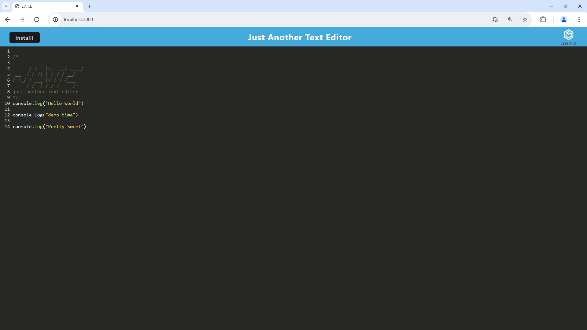

# MOD 19 Progressive Web Applications (PWA): Text Editor

## Description

This project was to create a Progressive Web Applications (PWA) text editor that runs in the browser. The app will be a single-page application that features several data persistence techniques that serve as redundancy in case one of the options is not supported by the browser. The application will also function offline. This application uses Node to build and run the application, and express.js for routes and server. This application also utilizes the webpack, work box and Babel among a few others packages to build and manage the PWA.

- My motivation was to create a text editor that runs in the browser. The app would be a single-page application that featured several data persistence techniques that served as redundancies in case one of the options is not supported by the browser, and to also have it work offline.
- I built this project so that my client and users could create notes or code snippets with or without an internet connection and reliably retrieve them for later use.
- This project solved the problem of being able to create notes or code snippets with or without an internet connection and reliably retrieve them for later use so that the user can update code once a connection has been established.
- I learned a lot from this project. I learned how to build a complex program, and by using the webpack library, bundle different modules together and then create a new package which consists of the very bare minimum number of files required, often just a single bundle,  which can be plugged in to the html file easily and used for the application 

## Table of contents

- [MOD 19 Progressive Web Applications (PWA): Text Editor](#mod-19-progressive-web-applications-pwa-text-editor)
  - [Description](#description)
  - [Table of contents](#table-of-contents)
  - [Installation](#installation)
  - [Usage](#usage)
  - [Contribute](#contribute)
  - [Questions](#questions)
  - [Deployed Site](#deployed-site)
  - [Credits](#credits)
  - [License](#license)

## Installation

To use this program, all you need to do is clone the repository from GitHub onto your computer or click the deployed site link below. If you clone it from the repository, open the root of the new folder, you can run `npm i` in the terminal. You are now set to run the actual program.

## Usage
If you cloned the repository then and ran `npm i`, then type in the terminal `npm run start` and press enter. Then you can have fun creating lines of code that will be stored in the cache memory for later use to cut and paste into the program you are coding.

If you click the deployed site link below then you can click the `Install` button on the top left to install it onto your computer. Or you can go ahead and have fun creating lines of code that will be stored in the cache memory for later use to cut and paste into the program you are coding.

## Contribute

If you would like to contribute to this project, please see below for my contact information.

## Questions

You can email me with any questions at <mwhellon@yahoo.com>

My Github profile can be located at <https://github.com/Michael-Hellon/>

## Deployed Site

The deployed site for the application is located at <https://progressive-web-applications-pwa-text-6jq9.onrender.com>

The following image shows the application functionality

The following image shows the application's manifest.json file:

The following image shows the application's registered service worker:

The following image shows the application's IndexedDB storage:

## Credits

I completed this project myself and used MOD 19’s mini-project as a guideline for this project. I used several pages from NPM <https://www.npmjs.com/package/webpack> and Render <https://docs.render.com/> for this project.

## License

To read more about the MIT license, click here ==> [License: MIT](https://opensource.org/licenses/MIT).

